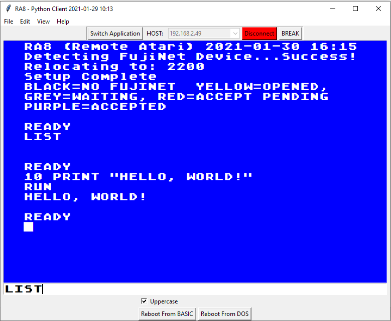

RA8-gui

This is a python client to RA8
Works in Windows, Mac and Linux

When RA8 is running, you can interact
with your Atari from anywhere in the
world.  

Text mode only.

Type what you want in the white text
field and press ENTER.

Port 6502 needs to be forwarded
to your Atari's Fujinet.

