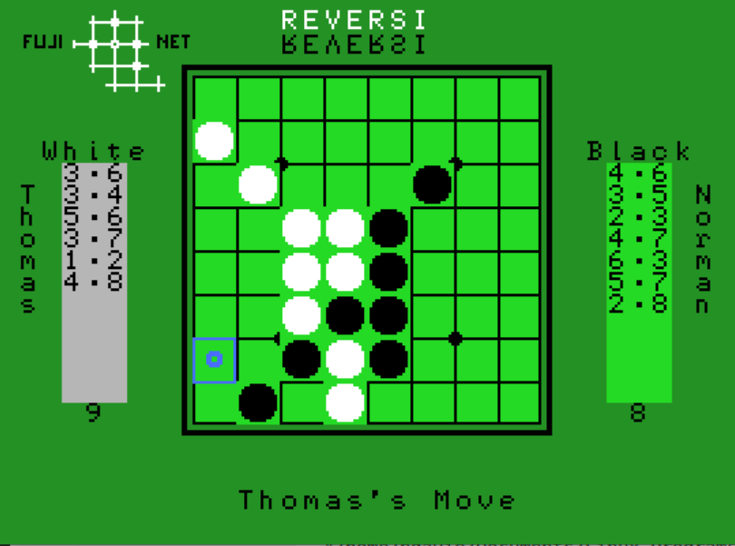

# Reversi

The original text based version was found as an example in the
z88dk examples folder called othello and has been adapted by
Norman Davie a.k.a TechCowboy.

With this program, you can now play against people running 
with a Fujinet or against the NABU.

Special thanks for Thomas Cherryhomes for providing the 
initial user interace and introducing me to Magellan which 
I used to create the current board screen and sprites.

## Set up requirements

You need z88dk compiler 
https://github.com/z88dk/z88dk
and gnu make. On windows I used cygwin
https://www.cygwin.com/

The Makefile was designed to allow you to switch between Windows
and Linux seemlessly provided you set up some environment variables. 

Set these environment variables in your .basrc or windows environment
to automagically run your code in the colem emulator however you will
not be able to do network play.
https://fms.komkon.org/ColEm/
 
COLEM_EXEC  = Coleco emulator executible with full path 
 
Optionally if you want to copy the files to a samba server, you
can set these environment variables

TNFS_SERVER = IP Address of samba server 
TNFS_SHARE  = The share name 
TNFS_DIR    = the directory within the share 
 

## Make options

make clean - remove previous compiled objects 
make       - build either the NABU homebrew or NABU CP/M executiable 
make tnfs  - copy the reversi.ddp file to your samba server 
make go    - run your reversi.ddp file in the emulator

## Graphics interface

The game board was created using Magellian; a TI-99/4a tile editor.
https://github.com/Rasmus-M/magellan

I wrote mag2c.py in Python 3 with takes the output of Magellian and replaces the
C source code for board.c, charset.c and spriteset.c -- a huge timesaver!

## Resources

FUJINET        [Fujinet Github](https://github.com/FujiNetWIFI) 
COLEM Emualtor https://fms.komkon.org/ColEm/ 
Magellian      https://github.com/Rasmus-M/magellan

